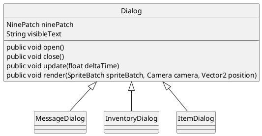

# 13 Boîtes de dialogues
> | Téléchargement fichiers référence |
> | ------------- |:-------------:|
> | <a href="./resources/part-avatar-attack/desktop.zip" download>desktop.zip</a> |
> | <a href="./resources/part-avatar-attack/core.src.zip" download>core.src.zip</a> |
> | <a href="./resources/part-avatar-attack/core.assets.zip" download>core.assets.zip</a> |

Auparavant, le text etait le seul moyen par lequel l'histoire etait transmise. A cet effet les boite de dialogues sont utilises afin de representer du text a l'ecran de maniere contextuel


Nouse allons programmer une boite de dialogue comme composante du tableau de bord. Le boite de dialogue peut etre reutilisee de plusieurs manieres dans le jeu.



## Cadre de la fenêtre
---
La technique que nous utilisons, est celle du *Nine Slice* (neuf tranche). Cette technique permet de dessiner une boite de taille arbitraire tout en preservant la taille des pixels. En se referant a l'image ci-dessous, il est question de dupliquez les section 2, 4, 6, 8 afin d'obtenir les dimensions desirees tout en preservant les sections 1, 3, 7, 9 dans les coins. 

### **Nine Slice [[0]](https://en.wikipedia.org/wiki/9-slice_scaling)**


> ## Étapes a suivre
> ---
> 1. Creez la classe `Dialog`
>     * Instantiez la classe `NinePatch` pour definir le cadre
>     * Affichez le `NineSlice`
> 2. Desactivez le controle de l'avatar lorsqu'une fenetre de dialogue est ouverte

```java
package com.tutorialquest.ui.dialogs;
// import ...

public class Dialog {
    public static final int WIDTH = 256;
    public static final int HEIGHT = 128/2;
    public static final int TEXTURE_SIZE = 24;
    public static final float MARGIN = 8;        

    protected NinePatch ninePatch;        
    protected TextureRegion[][] textures;    

    public Dialog()
    {        
        // Separation de la texture utilise pour le NineSlice en 9 sections
        textures = TextureRegion.split(
            new Texture("ui/rounded.png"), 
            TEXTURE_SIZE/3, 
            TEXTURE_SIZE/3);

        this.ninePatch = new NinePatch(
            textures[0][0], textures[0][1], textures[0][2],
            textures[1][0], textures[1][1], textures[1][2],
            textures[2][0], textures[2][1], textures[2][2]);
    }

    public void open()
    {
        Game.level.avatar.input.disable(-1);
        Game.hud.input.disable(.25f);
        enabled = true;
    }

    public void close()
    {
        enabled = false;
        Game.level.avatar.input.disable(.25f);
        Game.hud.input.disable(-1);
    }

    public void update(float deltaTime)
    {
        if(!enabled) return;
    }

    public void render(
        SpriteBatch spriteBatch,
        Camera camera,
        Vector2 position)
    {
        if(!enabled) return;

        spriteBatch.begin();

        // Affichage du NineSlice
        ninePatch.draw(
            spriteBatch, 
            position.x, 
            position.y, 
            0, 
            0, 
            WIDTH, 
            HEIGHT, 
            1, 
            1, 
            0);

        spriteBatch.end();
    }
}
```

