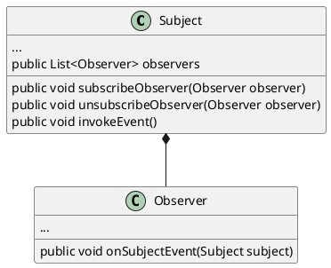
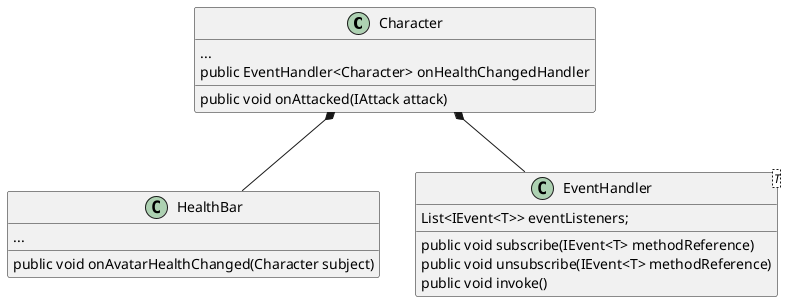

## 10.2 HUD
---
La deuxieme etape concernant l'interface est de connecter les visuels a la logique de jeu. Entre autre cela concerne mettre a jour la barre de vie lorsque le joueur est endommage.

La technique la plus repandu pour resoudre ce genre de probleme est d'utiliser le model **du sujet et de l'observateur**.


Le model de l'observateur permet la gestion simplifiée d'observateurs multiples sur un même sujet observable. Il s'agit de d'enregister les instance de `Observer` a l'interieur de `Subject` a l'aide d'une methode `subscribe`. Lorsqu'un evenement d'interet survient, notifier les observateurs a l'aide d'une methode `invoke`.

Nous adaptons ce model a notre interface graphique. La barre de vie (`HealthBar`) reagi aux changements des points de vie de l'avatar (`Character`). Afin de faciliter l'enregistrement, des observateur nous utilisons `onHealthChangedHandler` de la classe `EventHandler`.




### `Character.java`
```java
package com.tutorialquest.entities;
// import ...

public abstract class Character extends PhysicalObject {
    
    // ...

    @Override
    public void onAttacked(IAttack attack) {        
        // ...
        health -= attack.getDamage();

        // AJOUT:
        onHealthChangedHandler.invoke(this);
        if (health <= 0) {
            health = 0;
            onDefeated();
        }
    }

    public void heal(float value) {
        // ...
        health += value;
        if (health >= maxHealth) health = maxHealth;
        
        // AJOUT:
        onHealthChangedHandler.invoke(this);
    }
}
```

### `Avatar.java`
```java
package com.tutorialquest.entities;
// import ..

public class Avatar extends Character {

    // ..

    // AJOUT:
    @Override
    public void start() {
        super.start();

        // AJOUT:
        // Enregistrement de `HealthBar` afin l'element 
        // soit mis-a-jour lorsque les points de vie changent
        onHealthChangedHandler.subscribe(Game.hud::onAvatarHealthChanged);
    }

    // ..
}
```


### `HUD.java`
```java
package com.tutorialquest.entities;
// import ..

public class HUD
{
    // ...
    
    // AJOUT:
    public void onAvatarHealthChanged(Character character) {
        healthBar.onAvatarHealthChanged(character);
    }

    // ...
}
```

### `HealthBar.java`
```java
package com.tutorialquest.entities;
// import ...

public class HealthBar
{
    private float fillAmount = 1;

    // ... 

    public void render(SpriteBatch spriteBatch, Vector2 position, float scale)
    {
        // ...

        TextureRegion fillRegion = new TextureRegion(
            healtBarTextures[0][1],
            0,
            0,
            // MODIF:
            // healtBarTextures[0][1].getRegionWidth(),
            (int) (healtBarTextures[0][1].getRegionWidth() * fillAmount),
            healtBarTextures[0][1].getRegionHeight());
    
        // ...    
    }

    public void onAvatarHealthChanged(Character character) {
        fillAmount = character.health / character.getMaxHealth();
    }

    // ...
}
```

