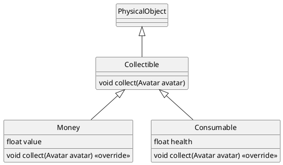

# 10.1 Trésors
> | Téléchargement fichiers référence |
> | ------------- |:-------------:|
> | <a href="./resources/part-avatar-attack/desktop.zip" download>desktop.zip</a> |
> | <a href="./resources/part-avatar-attack/core.src.zip" download>core.src.zip</a> |
> | <a href="./resources/part-avatar-attack/core.assets.zip" download>core.assets.zip</a> |

Tres souvent dans les jeux de style RPG, lorsque qu'un ennemi est vancu, il est susceptible de laisser derriere des trésor ou des recompense pour le joueur. Nous voulons ajouter cette fonctionalite a notre jeu. Dans le but de pouvoir eventuellement ajouter d'autre type d'objet a collectionner comme de la nourriture ou encore des equipements, nous utiliserons la classe abstraite `Collectible` comme classe de base pour nos *items* dans le niveau.



> ## Étapes a suivre
> ---
> 1. Ajoute le methode `onDefeated` a l'interieur de `Character` dans laquel on laisse tomber les tresors lorsque l'ennemi est vaincu
> 2. Ajoute la classe `Collectible` qui herite de `PhysicalObject`
> 3. A l'interieur ajoutez la methode `collect` qui sera surcharge par les differents types de collectible
> 4. Ajoute la classe `Money` qui herite de `Collectible`
> 5. Ajoute la methode `updateMoney` a l'interieur de `Character` 


### `Collectible.java`
```java
package com.tutorialquest.entities;
// import ...

public class Collectible extends PhysicalObject {

    protected Sprite sprite;
    private List<PhysicalObject> collisionResults;

    public enum Type
    {
        Health,
        Money,
        Item
    }

    public Collectible(Vector2 position) {
        super(position);
        // Ajout d'une boite de collision
        // pour permettre a l'avatar de ramasser                
        collider = new Collider(
            new Vector2(8, 8),                                
            Collider.FLAG_COLLECTIBLE);
        collider.origin.set(4, 4);
        collisionResults = new LinkedList<PhysicalObject>();
    }

    public void collect(Avatar avatar) {}

    @Override
    public void update(float deltaTime)
    {     
        // Detection de la collision
        collisionResults.clear();
        if(collider.getObjectCollisions(
            this,
            0,0,
            Collider.FLAG_AVATAR,
            collisionResults))
        {
            collect((Avatar) collisionResults.iterator().next());
            Game.level.remove(this);
            return;
        }

        collider.update(position);
    }

    @Override
    public void render(SpriteBatch spriteBatch) {
        super.render(spriteBatch);
        sprite.render(spriteBatch, position);
    }
}
```

### `Money.java`
```java
package com.tutorialquest.entities;
// import ...

public class Money extends Collectible {

    public static final Vector2 SIZE = new Vector2(16, 16);
    public static final float COPPER_COIN_VALUE = 1f;
    private int value;

    public Money(Vector2 position, float value)
    {
        super(position);

        this.value = value;
        String texturePath = "coin_copper.png";
        sprite = new Sprite(texturePath, SIZE);
    }

    @Override
    public void collect(Avatar avatar) {
        avatar.updateMoney(value);
    }
}

```

### `Avatar.java`
```java
package com.tutorialquest.entities;
// import ...

public class Avatar extends Character
{
    // ..
    @Override
    public void start() {
        super.start(); 
        // ...
        // ADDED:
        onMoneyChangedHandler.subscribe(Game.hud::onAvatarMoneyChanged);
    }
    // ..
}

```


## `Character.java`
```java
// package ..
// import ..

public abstract class Character extends PhysicalObject {

    // ADDED:
    public EventHandler<Character> onMoneyChangedHandler = new EventHandler<>();
    
    // ADDED:
    private float money = 0;
    public float getMoney() {return money;}
    public void updateMoney(float value)
    {
        money += value;
        onMoneyChangedHandler.invoke(this);
        if(money < 0)
            money = 0;
    }


    // ...
}
```

## `Enemy.java`
```java
public class Enemy extends Character {
    
    // ADDED:
    public void onDefeated()
    {
        super.onDefeated();
        Game.room.add(new Money(position, Money.COPPER_COIN_VALUE);
    }
}
```


### `HUD.java`
```java
package com.tutorialquest.ui;
// import ..

public class HUD {

    // ADDED:
    public void onAvatarMoneyChanged(Character character) {
        moneyIndicator.OnAvatarMoneyChanged(character);
    }
}
```

### `MoneyIndicator.java`
```java
package com.tutorialquest.ui;
// import ..

public class MoneyIndicator {

    // ..
    
    private float value = 0;

    // ..

    public void OnAvatarMoneyChanged(Character character) {
        value = character.getMoney();
    }
}


```


> ## Activité
> ---
> Il est possible de reutiliser le meme mecanisme afin de creer un *item* capable de restorer les points de vie de notre personnage.
> 1. Créez une classe `Consumable` qui dérive la classe `Collectible`
>     * Tout comme `Money`, invokez la methode collect au contact avec le joueur.
> 2. Restorer les points de vie du joueur a l'interieur de la methode `collect` 
> 3. Metez a jour l'interface graphique `HUD`


